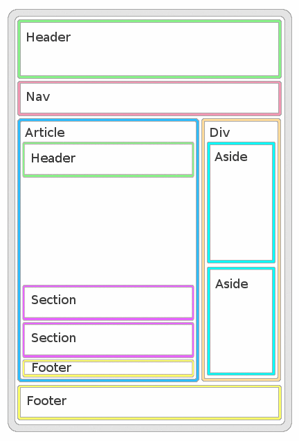

author: Lorenzo Franceschini
summary: CodeLabs teaching HTML - CSS - Lesson 1
id: html-css-1
categories: html, css, web
environments: Web
status: Draft

# Introduction to HTML and CSS

## HTML, DOM and the Browser
Duration: 0:20:00

### Warm up

All of us already know what is a web page and which technology are involved.
At this point of our study-path, we know that a web page is created by using HTML, CSS and JavaScript.
Internet is different from the Web, the first one is a network of computers, connected together by lan and wireless structures. No one owns the internet and the purpose of it, is to share data with a set of services and protocols such as files transfer (FTP), email (POP3/SMTP/IMAP), remote access (SSH), chat (IRC), calls (VoIP), Domain Name Service (DNS) or News (NNTP).
The web is a specific way to share information over the internet with the HTTP protocol. It allows documents to be linked to one another via hyper links and build a solid net of interconnected document all over the world.

The job to build a good website is hard, you need to organizes the content logically, give some search functionality, maybe you need to organize the data on a backend, works with UX (User eXperience) and UI (User Interface) designers and be aderent to the brand identity, reach the marketing goals and be search engine friendly to be ranked well on it. Your website must be look fine for various different devices and be "Responsive" and "Accessible" for all. You need also be adernt to the web standards and works hard to get good Site Performance.

Let's begin refreshing some ideas behind HTML and how our Browser works behind the scene.

HTML defines the structure of a web page using several semantic elements that define the purpose of texts, images and others resources within page. This brings us the principle of SoC (Separation of Concerns) where every techonoly is used for a spefic purpose:
- HTML: Semantic Structure of the Content
- CSS: Presentation of the Content
- JavaScript: Behaviour of the Elements

Thanks to SoC we can have advantages like: scalable website (or application), more readable and mantainable software, etc... .

HTML stand for HyperText Markup Language built as a language for the World Wide Web and use by the browser to interpret and show to us, text, images and link to other documents.

HTML is not a programming language, but a markup language, this means it is a language for identifying and describing the various elements in a document such as navigation and footer, heading and paragraphs, image and hyperlink. Thanks to a set of markup, we can indicate the document's underlying structure.

### The Structure

An HTML page is a file with the ".html" extension. Inside we can write HTML tag elements to define the structure and the content of the page:

```html
<element-name attr=value>content</element-name>
```

A HTML tag element is identified by a couple of tags (opening tag and closing tag) in the source code with a string within angle brackets and some key-value pairs that define the element attributes. An **attribute** is an additional information of the HTML element, such as the CSS Class, the ID for identification or attributes for sizing and value. Some of those attributes are shared by all the elements, others are specified to only a few set of tag elements.
[Here](https://html.com/attributes/) you can find a complete list of HTML tag attributes.

The web page is a parent-child relationship tree. With the html tag as the root element, divided by head and body section.
The head section contains only meta data and link to other resource like stylesheet (CSS) and script (JavaScript). This section is ignored by the rendering process, so no tag element inside head will be visible to our device.
The body section contains all the visible parts of our web page.




An element that is directly contained by another element is said to be the **child** of that element, and this is the **parent**. Elements that have the same parent are called **siblings**. All the elements within a given element are called **descendats**. A child is just a special kind of descendats, it's relative of the context. To be considered as a child, an elements needs to be directly under its parent element in the structure.
Understand the structure and the relationship between elements is crucial to understand how CSS works.

Try to find the errors:

```
<!DOCTYPE html>
<html lang="en">
	<body>
		</header>
			<h1>My Portfolio Web Page</h1>
			<p>A simple show gallery of my projects</p>
		</header>
		<section>
			<a href='#' alt='first-project'><h6>More info...</h6></a>
			<p>In this project called <b>The One, I encountered different problems, like:
			<ul></p>
				<li>...</li>
				<li>...</li>
				</ul>
			</ul>
		</section>
		<div>
			<aside>
				<!-- To-Do: .... -->
			</aside>
			<aside>
				<!-- To-Do: .... -->
			</aside>
		<div>
	</body>
</html>
```

You need to know that HTML is not so observant to the rules, and some errors can be tolerated by the HTML, like to omit the closing p tag, or omit html tag. I always reccomend to keep consistency and clarity when you write your code.

### The Browser

The main goal of every browser is to present on a device the resource you have request to a server. Tipically you request a web page from a web server. A browser, thanks to its rendering engine, can be show a lot of different kind of resources like: PDF, Images, Video or... an HTML Page.
When your browser start to read and parse an HTML page, it construct an in-memory structure called **DOM**, it acts like a tree.
Every HTML elements will be inside this structure and it can be thought like an object called **Node Element**, and the attributes of the HTML element will be the initial value of this node, called them **Property**. Then we have another tree called Render Tree, that contains styling information together with visual rules. Every leaf of this tree is a rectangle with visual attributes. The browser start as soon as possible to display the contents on the user device in the "layout-process" step.

### How we write HTML Code

We can write HTML in every editor on our computer or with a lot of online tools to make some test/mock and experiment for our studies.
We start writing some content typically in a `index.html` file, without think about the layout but only focus on the content organization with the right use of the tag element of HTML.

The very common basic structure is:

```html
<!DOCTYPE html>
<html lang="en">
<head>
	<title>Web Page Title</title>
	<meta chartset="utf-8">
</head>
<body>
	<!-- Put content here! -->
</body>
</html>
```

If you add a few of block of texts and use the very basic HTML tags such as `div`, `p` and `h1`, you can see that heading, div and paragraph start on new lines. This is because they are **block level** elements. Each block level element start in a new line and take the whole row of their container (the parent element). You can image it like a rectangle. Other tag element, like `span`, `a`, `img` or `strong` are **inline** elements. They don't start a new line.
Remember this rule: "never put a block element inside an inline element".

If you try to add dimension to an inline element, some properties will be applied, some properties will be partially applied and others will not be applied at all. The most noticable properties are width, height, margin and padding.
In a inline element, the width and height will be not applied to it. We can apply only right and left padding or margin.We can change the defalt display from inline to inline-block to get all the size properties.

After a basic structure we define a style sheet, usually a file called `style.css` and we link it to our `index.html` in the head section:

```html
<head>
	<title>Web Page Title</title>
	<meta chartset="utf-8">
	<link rel="stylesheet" href="style.css">
</head>
```


## HTML Tag Elements
Duration: 0:15:00

### The source code in HTML

When we writing HTML source code, we define a set of HTML Elements by using TAG ELEMENT.

The most common tag elements are: 

```
<html></html>
<title></title>
<head></head>
<body></body>
<div></div>
<h1></h1>
<h2></h2>
...
<h6></h6>
<p></p>
<a></a>

<b></b>
<i></i>
<strong></strong>
<em></em>
<hr></hr>
```

Probably you are familiar to this rules:

- not every HTML tags needs to be closed, some tags are self closing;
- some HTML tags needs to be unique like html, title, head and body;
- some HTML tags can have the same visual effect like b and strong but have different results for SEO;
- some HTML tags are mandatory like: !DOCTYPE, html and title. Those are the minimun tags to have a valid HTML page;
- certain tags can be omitted like html, head and body [LINK](https://html.spec.whatwg.org/multipage/syntax.html#syntax-tag-omission);
- every HTML tags can be enanched with **Attributes**, like a unique identifier with **id** attribute;
- avoid break your text with br, instead use the p tag;
- some HTML tags elements are empty such as 'hr', 'img' or 'br';
- we can add metadata to enhance search engine optimization, browser compatibilty and reach better performance in some devices;
- to organize better your page section, header, nav, article, footer with div, ul/ol and span are your best friend;
- not every mistakes are browser-breaking mistakes but they produce bad design and poor SEO performance.

One of the main purpose of HTML is to diplay text, images and link to other documents. The way to do it, is by using two tag elements: img and a (anchor tag):

```html
<p><span class="fa fa-heart"></span>Lorem Ipsum dolor sit amet, consectetur adipiscing elit. Phasellus pretium sodales urna, non mattis turpis tincidunt sit amet. Sed vel vulputate lacus. Donec sed ornare mauri...</p>

<a href='about.html' target='_self'>About Us</a>
```

### Span

The span element is a generic inline element used most of times to add icons to our text or for grouping and applying styles to inline elements.

### Paragraph

The paragraph element `p` is a container for a set of words. Ususally, browsers will render it between to empty line at the top and bottom of the paragraph.

### Heading

The heading element `h(1-6)` is a container to generates from the largest heading with `h1` to the smallest one with `h6`.
Usually we have an heading element before a paragraph element, inside a division element.

### Div

The division element `div` is a generic container, you can still contains a set of words such as `p`, but it's more semantic to use the paragraph and group more than one paragraph in one div element.

### Image

Image element is used to add... an image to our web page. With the `src` attribute we can specify the location of an image. It can be local or remote image. The `alt` attribute provides a text that dispalys if the browser can't load the image.

### Anchor

Anchor is one of the most important element on the web page, is the soul of the web because with it you can create hyperlink and all the net that connects our documents. We can refer also to other section of the same page, not only to other pages. The content of the anchor element becomes the hypertext link by using the attribe `href` by giving the address of the page (URL). We can use absolute URL such as `href="http://www.google.it"` or relative URL such as `href="catalogs/index.html"`. If we need to refer to a specifict point in a page, we need to use an id attribute to the element we want to refer and the hash tag in the href: `href="#about"` where about is an id attribute: `<section id="about">...</section>`.
There are others advanced use, such as mail link with `mailto:myemail@gmail.com` or link to a specific fragment of another page.

### List

We have three main types of lists:

- Unordered Lists. Collection of items that appear in no-order;
- Ordered Lists. List with a sequence number;
- Definition Lists. Lists that contains both terms and definitions.

All the elements `ul`, `ol`, `li`, `dl`, `dt` and `dd` are block level elements, which means that they always start on a new line by default.

### Preformatted Text
### Blockquote
### Organize Content: Article, Section, Aside, Div, Header, Footer, Nav
### Data: Form, Label, Input, Button, Select, Radio and checkbox
### Tables

## HTML Validation
Duration: 0:10:00

### Challenge

Positive
: Try to validate your HTML code by click [HERE](https://validator.w3.org/nu/#textarea):

Can you find the most minimum HTML valid code?

Let's define the basic structure:

```html
<!DOCTYPE html>
<html>
<head></head>
<body></body>
</html>
```

Now try to validate it. What's wrong with this code? Try to fix it, then try to find the most minimum code to get a green checking message.

## (HTML) Attributes vs. (DOM) Properties
Duration: 0:10:00

It's important to understand that the relationship between attributes and properties are not one-to-one relationship. Some HTML attributes don't have corresponding properties, like "colspan" and some DOM properties don't have corresponding HTML attributes like "textContent".

Positive
: Attributes are defined by HTML. Properties are defined by the DOM (Document Object Model). Attributes initialize DOM properties and then they are done. Property values can change; attribute values can't. The HTML attribute and the DOM property are not the same thing, even when they have the same name.

### Challenge

Positive
: Try to create an input element with some attributes (use at least id) and use the console.dir with document.getElementById to display all node's properties. If you want, try to add a value attribute and use document.getElementById and getAttribute to take the current value and the initial value.:

## Box Model

## CSS

HTML is used to specify the content, CSS (Cascading Style Sheet) is used to describe a web page's appearance on the user device. The role of CSS is to manage all the graphical aspects like: fonts family, fonts size, background colors or images, line spacing, etc..., all the page layout aspects will be controlled by CSS, and we can control this layout also for different devices and contexts other than a browser, such as screen reader or a printer device.

So, the way we do it is by using a set of rules defined in a style sheet file (or more than one file), where we use a lot of different selectors to select one or more HTML elements on the web page. The main selectors are:

- Type Selectors (select all the `a`, `div`, etc...);
- Class Selectors (select all the element with one or more css className defined as tag attribute);
- Id Selectors (select a specific element with the id attribue);
- Universal Selector (select all the page elements).

For example:

```
div {
	width: 50%;
	height: 50%;
}

.header {
	background-color: green;
}

#main-title {
	font-size: 48rem;
}

* {
	line-spacing: 0.5px;
}
```